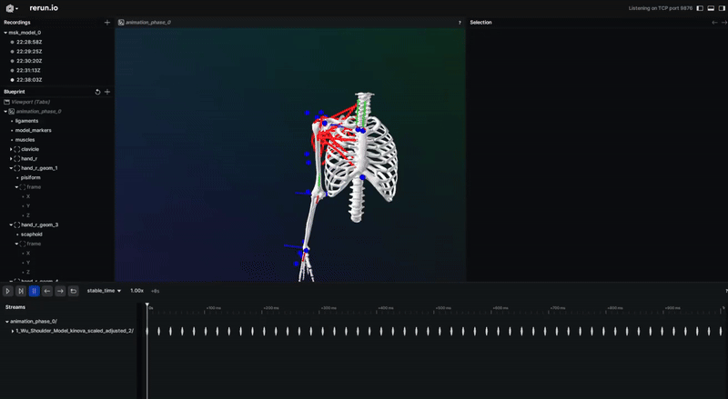

<div align="center"><a name="readme"></a>

<p align="center"> 
  
</p>

# Cocofest

An Open-Source Python Package for Functional Electrical Stimulation (FES) Optimization in Optimal Control.<br/>
Supports predictive musculoskeletal simulation driven by FES, moving time horizon, and model identification.<br/>
"Prototype today’s FES to power tomorrow’s rehab."

[](https://www.python.org/)
[]()
[]()<br/>
[](https://codecov.io/gh/pyomeca/cocofest)
[](https://qlty.sh/gh/pyomeca/projects/cocofest)
[](https://github.com/pyomeca/cocofest/actions/workflows/run_tests_win.yml)<br/>
[](https://discord.gg/s3g2ATpvDs)
[](https://opensource.org/licenses/MIT)

</div>

<details>
<summary><kbd>Table of contents</kbd></summary>

[About](#-about)

[Installation](#-installation)
<details>
<summary><a href="#features">Features</a></summary>

- [Available FES models](#-available-fes-models-)
- [Musculoskeletal model driven by FES](#-musculoskeletal-model-driven-by-fes-)
- [Moving time horizons](#-moving-time-horizons-)
- [Identification](#-identification-)
- [Initial value problem](#-initial-value-problem-)
- [Summation truncation](#-summation-truncation-)
</details>

<br>

<details>
<summary><a href="#other">Other</a></summary>

- [Want to contribute?](#-want-to-contribute-)
- [Contributors](#-contributors-)
- [Citing](#-citing)
- [Cited in](#-cited-in)
- [Other related projects](#other-related-projects)
- [Acknowledgements](#-acknowledgements)
</details>

</details>

<p align="center"> 
  
</p>


<h1 align="center">
  
  About
</h1>

Functional electrical stimulation (FES) is a neurorehabilitation technique that promotes motor recovery after neurological injury.
By delivering coordinated electrical pulses to targeted muscles, FES elicits functional movements such as walking, reaching, and grasping.
Because responses to stimulation vary across individuals and muscle groups, most FES protocols still rely on empirically tuned parameters.
These settings can cause over stimulation, early muscle fatigue on-set, and reduce therapeutic gains.

Advanced control approaches like optimal control-driven FES can improve FES rehabilitation efficiency by personalizing stimulation parameters to a specific task and patient.
Therefore, we designed `Cocofest` (Custom Optimal COntrol for Functional Electrical STimulation) an open-source Python package for optimal control-driven FES.
`Cocofest` relies on [bioptim](https://github.com/pyomeca/bioptim), an optimal control program framework for biomechanics.
[bioptim](https://github.com/pyomeca/bioptim) uses [biorbd](https://github.com/pyomeca/biorbd) a biomechanics library, benefits from powerful algorithmic differentiation provided by [CasADi](https://web.casadi.org/)
and robust solver like [Ipopt](https://github.com/coin-or/Ipopt).
</br>

> \[!IMPORTANT]
>
> `Cocofest` as no clinical clearance and should not be used for rehabilitation purposes. </br>
> Don't forget to <a href="https://github.com/pyomeca/cocofest/stargazers"> </a>
> the repository to show your support and help us grow the community!

<p align="center"> 
  
</p>

<h1 align="center">
  
  Installation
</h1>

Currently, no anaconda installation is available. The installation must be done from the sources. <br>
**Cloning** the repository is the first step to be able to use the package.

### Dependencies
`Cocofest` relies on several libraries. 
So carefully follow these steps to get everything installed to use `Cocofest`.
</br>
First, create a new conda environment
```bash
conda create -n YOUR_ENV_NAME python=3.11
```

Then, activate the environment
```bash
conda activate YOUR_ENV_NAME
```

After, install the dependencies
```bash
conda install numpy matplotlib pytest casadi biorbd pyorerun -c conda-forge
```

Finally, install the bioptim setup.py file located in your cocofest/external/bioptim folder
```bash
cd <path_up_to_cocofest_file>/external/bioptim
python setup.py install
```

You are now ready to use `Cocofest`!

<p align="center"> 
  
</p>

<h1 align="center">
  
  Features
</h1>


## 📊 Available FES models
All models are implemented at the muscle actuator level, making them applicable to a wide range of problems regardless of the specific optimal control problem.

| **Model Name**  | **Citation**                                                                                                                                                                                                                                    | **Description / Focus**                                             |
| --------------- |-------------------------------------------------------------------------------------------------------------------------------------------------------------------------------------------------------------------------------------------------| ------------------------------------------------------------------- |
| **Veltink1992** | Veltink, P. H., Chizeck, H. J., Crago, P. E., & El-Bialy, A. (1992). *Nonlinear joint angle control for artificially stimulated muscle*. IEEE Transactions on Biomedical Engineering, 39(4), 368–380.                                           | Nonlinear control of joint angles via electrical stimulation.       |
| **Riener1996**  | Riener, R., Quintern, J., & Schmidt, G. (1996). *Biomechanical model of the human knee evaluated by neuromuscular stimulation*. Journal of Biomechanics, 29(9), 1157–1167.                                                                      | Biomechanical knee model validated using neuromuscular stimulation. |
| **Ding2003**    | Ding, J., Wexler, A. S., & Binder-Macleod, S. A. (2003). *Mathematical models for fatigue minimization during functional electrical stimulation*. Journal of Electromyography and Kinesiology, 13(6), 575–588.                                  | Focus on mathematical models for minimising fatigue.                |
| **Ding2007**    | Ding, J., Chou, L. W., Kesar, T. M., et al. (2007). *Mathematical model that predicts the force–intensity and force–frequency relationships after spinal cord injuries*. Muscle & Nerve, 36(2), 214–222.                                        | Predicts force–intensity and force–frequency responses post-SCI.    |
| **Marion2009**  | Marion, M. S., Wexler, A. S., Hull, M. L., & Binder-Macleod, S. A. (2009). *Predicting the effect of muscle length on fatigue during electrical stimulation*. Muscle & Nerve, 40(4), 573–581.                                                   | Examines muscle length impact on fatigue under stimulation.         |
| **Marion2013**  | Marion, M. S., Wexler, A. S., & Hull, M. L. (2013). *Predicting non-isometric fatigue induced by electrical stimulation pulse trains as a function of pulse duration*. Journal of NeuroEngineering and Rehabilitation, 10, 1–16.                | Predicts non-isometric fatigue based on pulse duration.             |
| **Hmed2018**    | Hmed, A. B., Bakir, T., Garnier, Y. M., Sakly, A., Lepers, R., & Binczak, S. (2018). An approach to a muscle force model with force-pulse amplitude relationship of human quadriceps muscles. Computers in Biology and Medicine, 101, 218-228.  | Models the relationship between pulse amplitude and force.          |

> \[!NOTE]
>
> It is possible to implement more FES models into Cocofest.
> Adventurous enough to code it by yourself, we are looking forward to read your [pull request](how-to-contribute).
> Feel free to reach out on discord or submit an issue if you need help.

## 🦴 Musculoskeletal model driven by FES

In conventional Hill-type muscle model, muscle force ($F_m$) is the product of a the muscle activation, $F_{max}$ the maximal
isometric muscle force, $f_l$ the force-length, $f_v$ the force-velocity and $f_{pas}$ the passive force-length relationship:
```math
F_m(t) = a(t)\, F_{\max}\, f_l(\tilde{l}_m)\, f_v(\tilde{v}_m) + f_{pas}(\tilde{l}_m)
```
<br>
`Cocofest` replaces $a(t)$ × $F_{max}$ by the force obtained using [FES models](#available-fes-models).
This approach allows motions driven-FES simulations, meanwhile benefiting from musculoskeletal model properties (e.g., muscle insertion, weight, inertial).

> \[!NOTE]
>
> Used force-length ($f_l$), force-velocity ($f_v$) and passive force-length ($f_{pas}$) are those published by [De Groot et al., (2016)](https://link.springer.com/article/10.1007/s10439-016-1591-9).
> Those relationships can be activated or not when initializing your OCP. Modification to the following [file](cocofest/models/hill_coefficients.py) can be done to have more/different relationships. 

### 💻 A short musculoskeletal FES-driven example
The following example displays a reaching task using the [Arm26](https://opensimconfluence.atlassian.net/wiki/spaces/OpenSim/pages/53090607/Musculoskeletal+Models) model driven by the [Ding2007](https://onlinelibrary.wiley.com/doi/full/10.1002/mus.20806) FES model.

```math
\begin{aligned}
\min_{x(\cdot),\,u(\cdot)} \quad 
& \int_{0}^{T} \sum_{i=1}^{n} F_{m,i}(t)\,dt \\[4pt]
\text{s.t.:}\quad
& q_{\text{arm}}(t) \in [-0.5,\, 3.14], && \forall t \in [0,T],\\
& q_{\text{forearm}}(t) \in [0,\, 3.14], && \forall t \in [0,T],\\
& \text{(last node)}\;\; \|p_{\text{hand\_marker}}(T) - p_{\text{target\_marker}}\| \le \varepsilon,\\
& u(t) = \begin{bmatrix}
  \mathrm{pw}_{1}(t)\\ \mathrm{pw}_{2}(t)\\ \vdots\\ \mathrm{pw}_{n}(t)
\end{bmatrix}
\;\; \text{(pulse widths per muscle)}.
\end{aligned}
```

<br>

<p align="center">
   <br>
  Figure 1: Motion performed for the reaching task and associated muscle force production.
</p>

> \[!NOTE]
>
> Solved in 6.7 second, computer with an AMD Ryzen Threadripper PRO 7965WXs x 48 processor. <br>
> Additional information: frequency = 30Hz, n_shooting = 30, step = 0.033s, final time = 1s, integration = Collocation radau method, polynomial_order = 3, solver = IPOPT.

You can find more examples of musculoskeletal model driven by FES in the following [file](https://github.com/pyomeca/cocofest/tree/main/examples/fes_multibody).

## ⏳ Moving time horizons

For longer time span simulation and apprehend muscle fatigue apparition, `Cocofest` implements moving time horizons (MHE).

### 💻 A short MHE hand cycling FES-driven example

```math
\begin{aligned}
\min_{x(\cdot),\,u(\cdot)} \quad 
& \int_{0}^{T} \sum_{i=1}^{n} F_{m,i}(t)\,dt \\[4pt]
\text{s.t.:}\quad
& q_{\text{arm}}(t) \in [0,\, 1.5], && \forall\, t \in [0,T],\\
& q_{\text{forearm}}(t) \in [0.5,\, 2.5], && \forall\, t \in [0,T],\\
& q_{\text{pedal}}(t) \in [0,\, 6.28], && \forall\, t \in [0,T],\\
& \text{(first node)}\;\; \left\|\,\mathrm{center}_{\text{wheel}}(t_{0}) -
\begin{bmatrix} 0.35 \\ 0 \end{bmatrix}\right\| \le \varepsilon,\\
& \text{(first node)}\;\; \left\|\,\dot{\mathrm{center}}_{\text{wheel}}(t_{0}) - 0\right\| \le \varepsilon,\\
& \text{(last node)}\;\; \left\|\,q_{\text{pedal}}(T) - 6.28\right\| \le \varepsilon,\\
& u(t) = \begin{bmatrix} \mathrm{pw}_{1}(t)\\ \mathrm{pw}_{2}(t)\\ \vdots\\ \mathrm{pw}_{n}(t) \end{bmatrix}
\;\; \text{(pulse widths per muscle)}.
\end{aligned}
```

<br>

<p align="center">
   <br>
  Figure 2: Motion performed for the cycling task, muscle force contribution per section inspired by
  <a href="https://www.frontiersin.org/journals/sports-and-active-living/articles/10.3389/fspor.2025.1581301/full">
    Quittmann et al. (2025)
  </a>
  and muscle force production above 10% of the maximal force.
</p>

> \[!NOTE]
>
> Solved in 1.02 second, computer with an AMD Ryzen Threadripper PRO 7965WXs x 48 processor. <br>
> Additional information: frequency = 30Hz, n_shooting = 60, step = 0.033s, final time = 2s, integration = Collocation radau method, polynomial_order = 3, solver = IPOPT, simultaneous turn per optimization = 2. 

## 🎯 Initial value problem

The initial value problem feature enables forward nonlinear dynamic integration to simulate the model’s behavior from given initial state and controls (i.e., series of pulse trains). 
This also permits comparison between FES models without using optimal control methods.

For that, the IvpFes class is used to build the problem.

```python
from cocofest import IvpFes, DingModelFrequencyWithFatigue

fes_parameters = {"model": DingModelFrequencyWithFatigue(), "n_stim": 10}
ivp_parameters = {"n_shooting": 20, "final_time": 1}

ivp = IvpFes(fes_parameters, ivp_parameters)

result, time = ivp.integrate()
```

## 🔎 Identification

To personalize FES models to simulated or experimental force, `Cocofest` supports model identification using optimal control.

### 💻 A short model identification example

```math
\begin{aligned}
\min_{x(\cdot),\,p(\cdot)} \quad 
& \int_{0}^{T} \bigl(F(t) - F_{\text{sim/exp}}(t)\bigr)\,dt \\[4pt]
\text{s.t.:}\quad
& u(t) = \begin{bmatrix} \mathrm{pw}_{1}(t)\\ \mathrm{pw}_{2}(t)\\ \vdots\\ \mathrm{pw}_{n}(t) \end{bmatrix}
= \begin{bmatrix} \mathrm{pw}_{\text{exp}1}(t)\\ \mathrm{pw}_{\text{exp}2}(t)\\ \vdots\\ \mathrm{pw}_{\text{exp}n}(t) \end{bmatrix}.
\end{aligned}
```

<p align="center">
   <br>
  Figure 3: Model identification optimization
</p>

> \[!NOTE]
>
> Solved in 0.343 second, computer with an AMD Ryzen Threadripper PRO 7965WXs x 48 processor. <br>
> Additional information: frequency = 33Hz, n_shooting = 66, step = 0.03s, final time = 2s, integration = Runge-Kutta 4, integration steps = 10, solver = IPOPT. 


## ✂️ Summation truncation

`Cocofest` also incorporates the recent numerical truncation method to speed up convergence.
This method limits the number of past stimulations considered in the dynamics to reduce the dependency on time-varying states.

```python
model = ModelMaker.create_model("ding2007", stim_time=stim_time, sum_stim_truncation=10)
```

> \[!TIP]
>
> To determine the value to use for `sum_stim_truncation`, you can refer to [Tiago et al. (2025)](https://inria.hal.science/hal-05165086/) or [Co et al. (2024)](https://umontreal.scholaris.ca/items/a94c280a-98dc-48ad-888c-e11c7c6a0d55).


<p align="center"> 
  
</p>

<h1 align="center">
  
  Other
  
</h1>

## 🙌 Want to contribute?

We are always looking for new contributors to help us improve `Cocofest`. <br>
Feel free to check our [contributing guidelines](docs/contributing.md) to get started.

Don't know where to start? [Issues](https://github.com/pyomeca/cocofest/issues) tagged with "Good first issues" are a great place to begin!

## 🤝 Contributors

<a href="https://github.com/Kev1CO"></a>
<a href="https://github.com/Ipuch"></a>
<a href="https://github.com/Florine353"></a>


## 📝 Citing
`Cocofest` is not yet published. <br>
Meanwhile, if you use `Cocofest`, please cite the following zenodo link: [10.5281/zenodo.10427934](https://doi.org/10.5281/zenodo.10427934).

## 📚 Cited in
> \[!NOTE]
> If you used `Cocofest` in your research, please let us know by submitting an issue or a pull request to add your publication to this list.

##   Other related projects  

<table>
  <tr>
    <td align="center">
      <a href="https://github.com/pyomeca/bioptim">
      </a>
    </td>
    <td align="center">
      <a href="https://github.com/pyomeca/biorbd"> 
      </a>
    </td>
    <td align="center">
      <a href="https://github.com/pyomeca/pyorerun"> 
      </a>
    </td>
    <td align="center">
      <a href="https://github.com/pyomeca/biobuddy">
      </a>
    </td>
    <td align="center">
      <a href="https://github.com/s2mLab/pyScienceMode">
        
      </a>
    </td>
  </tr>
</table>


## 🙏 Acknowledgements

### 🌱 Funding
<a href="https://regroupementinter.com/fr/mandat/160-optistim/"></a>
&nbsp;&nbsp;&nbsp;
<a href="https://frq.gouv.qc.ca"></a>

###  Logo and assets design
<a href="https://www.instagram.com/maxmvpainting/"></a>

<p align="center"> 
  
</p>