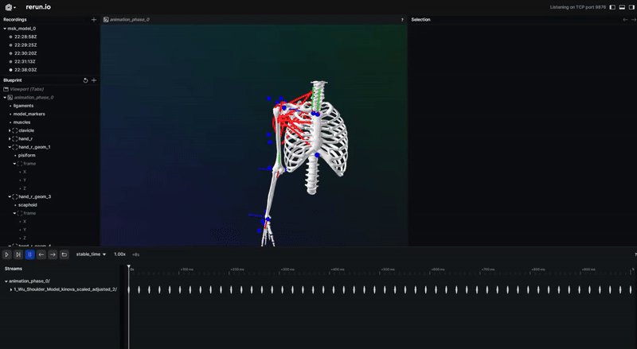

<div align="center"><a name="readme"></a>

<p align="center"> 
  
</p>

# Cocofest

An Open-Source Python Package for Functional Electrical Stimulation (FES) Optimization in Optimal Control.<br/>
Supports predictive musculoskeletal simulation driven by FES, moving time horizon, and model identification.<br/>
"Prototype today’s FES to power tomorrow’s rehab."

[](https://www.python.org/)
[]()
[]()<br/>
[](https://codecov.io/gh/pyomeca/cocofest)
[](https://qlty.sh/gh/pyomeca/projects/cocofest)
[](https://github.com/pyomeca/cocofest/actions/workflows/run_tests_win.yml)<br/>
[](https://discord.gg/s3g2ATpvDs)
[](https://opensource.org/licenses/MIT)

</div>

<details>
  <summary><kbd>Table of contents</kbd></summary>

- [About](#about)
- [Installation](#installation)
- [Features](#features)
  - [Available FES models](#available-fes-models)
  - [Musculoskeletal model driven by FES](#musculoskeletal-model-driven-by-fes)
  - [Moving time horizons](#moving-time-horizons)
  - [Cycling fatigue solver benchmark](#cycling-fatigue-solver-benchmark)
  - [Identification](#identification)
  - [Initial value problem](#initial-value-problem)
  - [Summation truncation](#summation-truncation)
- [Other](#other)
  - [Want to contribute?](#want-to-contribute)
  - [Contributors](#contributors)
  - [Citing](#citing)
  - [Cited in](#cited-in)
  - [Other related projects](#other-related-projects)
  - [Acknowledgements](#acknowledgements)

</details>


<p align="center"> 
  
</p>

<a id="about"></a>
<h1 align="center">
  
  About
</h1>

Functional electrical stimulation (FES) is a neurorehabilitation technique that promotes motor recovery after neurological injury.
By delivering coordinated electrical pulses to targeted muscles, FES elicits functional movements such as walking, reaching, and grasping.
Because responses to stimulation vary across individuals and muscle groups, most FES protocols still rely on empirically tuned parameters.
These settings can cause over stimulation, early muscle fatigue on-set, and reduce therapeutic gains.

Advanced control approaches like optimal control-driven FES can improve FES rehabilitation efficiency by personalizing stimulation parameters to a specific task and patient.
Therefore, we designed `Cocofest` (Custom Optimal COntrol for Functional Electrical STimulation) an open-source Python package for optimal control-driven FES.
`Cocofest` relies on [bioptim](https://github.com/pyomeca/bioptim), an optimal control program framework for biomechanics.
[bioptim](https://github.com/pyomeca/bioptim) uses [biorbd](https://github.com/pyomeca/biorbd) a biomechanics library, benefits from powerful algorithmic differentiation provided by [CasADi](https://web.casadi.org/)
and robust solver like [Ipopt](https://github.com/coin-or/Ipopt).
</br>

> \[!IMPORTANT]
>
> `Cocofest` as no clinical clearance and should not be used for rehabilitation purposes. </br>
> Don't forget to <a href="https://github.com/pyomeca/cocofest/stargazers"> </a>
> the repository to show your support and help us grow the community!

<p align="center"> 
  
</p>

<a id="installation"></a>
<h1 align="center">
  
  Installation
</h1>

Currently, no anaconda installation is available. The installation must be done from the sources. <br>
**Cloning** the repository is the first step to be able to use the package.

### Dependencies
`Cocofest` relies on several libraries. 
So carefully follow these steps to get everything installed to use `Cocofest`.
</br>
First, create a new conda environment
```bash
conda create -n YOUR_ENV_NAME python=3.11
```

Then, activate the environment
```bash
conda activate YOUR_ENV_NAME
```

After, install the dependencies
```bash
conda install numpy matplotlib pytest casadi biorbd pyorerun bioptim==3.4.0 -c conda-forge
```

You are now ready to use `Cocofest`!

<p align="center"> 
  
</p>

<a id="features"></a>
<h1 align="center">
  
  Features
</h1>

<a id="available-fes-models"></a>
## 📊 Available FES models
All models are implemented at the muscle actuator level, making them applicable to a wide range of problems regardless of the specific optimal control problem.

| **Model Name**  | **Citation**                                                                                                                                                                                                                                    | **Description / Focus**                                             |
| --------------- |-------------------------------------------------------------------------------------------------------------------------------------------------------------------------------------------------------------------------------------------------| ------------------------------------------------------------------- |
| **Veltink1992** | Veltink, P. H., Chizeck, H. J., Crago, P. E., & El-Bialy, A. (1992). *Nonlinear joint angle control for artificially stimulated muscle*. IEEE Transactions on Biomedical Engineering, 39(4), 368–380.                                           | Nonlinear control of joint angles via electrical stimulation.       |
| **Riener1996**  | Riener, R., Quintern, J., & Schmidt, G. (1996). *Biomechanical model of the human knee evaluated by neuromuscular stimulation*. Journal of Biomechanics, 29(9), 1157–1167.                                                                      | Biomechanical knee model validated using neuromuscular stimulation. |
| **Ding2003**    | Ding, J., Wexler, A. S., & Binder-Macleod, S. A. (2003). *Mathematical models for fatigue minimization during functional electrical stimulation*. Journal of Electromyography and Kinesiology, 13(6), 575–588.                                  | Focus on mathematical models for minimising fatigue.                |
| **Ding2007**    | Ding, J., Chou, L. W., Kesar, T. M., et al. (2007). *Mathematical model that predicts the force–intensity and force–frequency relationships after spinal cord injuries*. Muscle & Nerve, 36(2), 214–222.                                        | Predicts force–intensity and force–frequency responses post-SCI.    |
| **Marion2009**  | Marion, M. S., Wexler, A. S., Hull, M. L., & Binder-Macleod, S. A. (2009). *Predicting the effect of muscle length on fatigue during electrical stimulation*. Muscle & Nerve, 40(4), 573–581.                                                   | Examines muscle length impact on fatigue under stimulation.         |
| **Marion2013**  | Marion, M. S., Wexler, A. S., & Hull, M. L. (2013). *Predicting non-isometric fatigue induced by electrical stimulation pulse trains as a function of pulse duration*. Journal of NeuroEngineering and Rehabilitation, 10, 1–16.                | Predicts non-isometric fatigue based on pulse duration.             |
| **Hmed2018**    | Hmed, A. B., Bakir, T., Garnier, Y. M., Sakly, A., Lepers, R., & Binczak, S. (2018). An approach to a muscle force model with force-pulse amplitude relationship of human quadriceps muscles. Computers in Biology and Medicine, 101, 218-228.  | Models the relationship between pulse amplitude and force.          |


> \[!NOTE]
>
> It is possible to implement more FES models into Cocofest.
> Adventurous enough to code it by yourself, we are looking forward to read your [pull request](how-to-contribute).
> Feel free to reach out on discord or submit an issue if you need help.

<a id="musculoskeletal-model-driven-by-fes"></a>
## 🦴 Musculoskeletal model driven by FES

In conventional Hill-type muscle model, muscle force ($F_m$) is the product of $a$ the muscle activation, $F_{max}$ the maximal
isometric muscle force, $f_l$ the force-length, $f_v$ the force-velocity and $f_{pas}$ the passive force-length relationship:
```math
F_m(t) = a(t)\, F_{\max}\, f_l(\tilde{l}_m)\, f_v(\tilde{v}_m) + f_{pas}(\tilde{l}_m)
```

`Cocofest` replaces $a(t)$ × $F_{max}$ by the force obtained using [FES models](#available-fes-models).
This approach allows motions driven-FES simulations, meanwhile benefiting from musculoskeletal model properties (e.g., muscle insertion, weight, inertial).

> \[!NOTE]
>
> Used force-length ($f_l$), force-velocity ($f_v$) and passive force-length ($f_{pas}$) are those published by [De Groot et al., (2016)](https://link.springer.com/article/10.1007/s10439-016-1591-9).
> Those relationships can be activated or not when initializing your OCP. Modification to the following [file](cocofest/models/hill_coefficients.py) can be done to have more/different relationships. 

### 💻 A short musculoskeletal FES-driven example
The following example displays a reaching task using the [Arm26](https://opensimconfluence.atlassian.net/wiki/spaces/OpenSim/pages/53090607/Musculoskeletal+Models) model driven by the [Ding2007](https://onlinelibrary.wiley.com/doi/full/10.1002/mus.20806) FES model.

```math
\begin{aligned}
\min_{x(\cdot),\,u(\cdot)} \quad 
& \int_{0}^{T} \sum_{i=1}^{n} F_{m,i}(t)\,dt \\[4pt]
\text{s.t.:}\quad
& q_{\text{arm}}(t) \in [-0.5,\, 3.14], && \forall t \in [0,T],\\
& q_{\text{forearm}}(t) \in [0,\, 3.14], && \forall t \in [0,T],\\
& \text{(last node)}\;\; \|p_{\text{hand\_marker}}(T) - p_{\text{target\_marker}}\| \le \varepsilon,\\
& u(t) = \begin{bmatrix}
  \mathrm{pw}_{1}(t)\\ \mathrm{pw}_{2}(t)\\ \vdots\\ \mathrm{pw}_{n}(t)
\end{bmatrix}
\;\; \text{(pulse widths per muscle)}.
\end{aligned}
```

<br>

<p align="center">
   <br>
  Figure 1: Motion performed for the reaching task and associated muscle force production.
</p>

> \[!NOTE]
>
> Solved in 6.7 second, computer with an AMD Ryzen Threadripper PRO 7965WXs x 48 processor. <br>
> Additional information: frequency = 30Hz, n_shooting = 30, step = 0.033s, final time = 1s, integration = Collocation radau method, polynomial_order = 3, solver = IPOPT.

You can find more examples of musculoskeletal model driven by FES in the following [file](https://github.com/pyomeca/cocofest/tree/main/examples/fes_multibody).

<a id="moving-time-horizons"></a>
## ⏳ Moving time horizons

For longer time span simulation and apprehend muscle fatigue apparition, `Cocofest` implements moving time horizons (MHE).

### 💻 A short MHE hand cycling FES-driven example

```math
\begin{aligned}
\min_{x(\cdot),\,u(\cdot)} \quad 
& \int_{0}^{T} \sum_{i=1}^{n} F_{m,i}(t)\,dt \\[4pt]
\text{s.t.:}\quad
& q_{\text{arm}}(t) \in [0,\, 1.5], && \forall\, t \in [0,T],\\
& q_{\text{forearm}}(t) \in [0.5,\, 2.5], && \forall\, t \in [0,T],\\
& q_{\text{pedal}}(t) \in [0,\, 6.28], && \forall\, t \in [0,T],\\
& \text{(first node)}\;\; \left\|\,\mathrm{center}_{\text{wheel}}(t_{0}) -
\begin{bmatrix} 0.35 \\ 0 \end{bmatrix}\right\| \le \varepsilon,\\
& \text{(first node)}\;\; \left\|\,\dot{\mathrm{center}}_{\text{wheel}}(t_{0}) - 0\right\| \le \varepsilon,\\
& \text{(last node)}\;\; \left\|\,q_{\text{pedal}}(T) - 6.28\right\| \le \varepsilon,\\
& u(t) = \begin{bmatrix} \mathrm{pw}_{1}(t)\\ \mathrm{pw}_{2}(t)\\ \vdots\\ \mathrm{pw}_{n}(t) \end{bmatrix}
\;\; \text{(pulse widths per muscle)}.
\end{aligned}
```

<br>

<p align="center">
   <br>
  Figure 2: Motion performed for the cycling task, muscle force contribution per section inspired by
  <a href="https://www.frontiersin.org/journals/sports-and-active-living/articles/10.3389/fspor.2025.1581301/full">
    Quittmann et al. (2025)
  </a>
  and muscle force production above 10% of the maximal force.
</p>

> \[!NOTE]
>
> Solved in 1.02 second, computer with an AMD Ryzen Threadripper PRO 7965WXs x 48 processor. <br>
> Additional information: frequency = 30Hz, n_shooting = 60, step = 0.033s, final time = 2s, integration = Collocation radau method, polynomial_order = 3, solver = IPOPT, simultaneous turn per optimization = 2. 

The cycling fatigue MHE can also benchmark the optional MadNLP and Alpaqa
Bioptim integrations. See the
[solver setup, warm-start policy, and benchmark results](docs/optional_nlp_solvers.md).

<a id="cycling-fatigue-solver-benchmark"></a>
## Cycling fatigue solver benchmark

The endurance benchmark minimizes fatigue with four Ding fatigue muscle
models. Its default is **one pedalling cycle per OCP** and 30 pulse-width
controls per muscle and cycle. Therefore, `cycles=100` means 100 consecutive
one-cycle receding-horizon optimizations (100 RHO), not a single OCP containing
100 cycles. A two-cycle OCP remains available with `cycles_per_window=2`, but
ACADOS is currently benchmarked only with one cycle.

The benchmark uses zero external crank assistance, an absolute terminal crank
angle target with a `0.002 rad` tolerance, and two allowed consecutive
failures. Pulse widths are validated and clipped to each muscle's physical
interval `[pd0, 600 us]`; `pd0` is the Ding model's zero-recruitment pulse
duration, approximately `131.405 us`, rather than a numerical pulse width of
zero.

### Changes made during the solver study

1. The sign of the external crank torque was made explicit and the current
   endurance problem was changed to `0 N.m` assistance to expose fatigue
   earlier.
2. The terminal crank target was made absolute in cycle count. It no longer
   follows the previous solution, which prevents accumulated angular drift.
3. Historical seeds are validated at load time, including model,
   transcription, torque, horizon and pulse-width metadata. Pulse widths are
   clipped to `[pd0, 600 us]`, with warnings for repaired legacy values.
4. A common, solver-independent primal seed is produced once with IPOPT and
   consumed by IPOPT, Fatrop, MadNLP and ACADOS. Its recorded consumed warmup
   cycle must be preserved by every consumer.
5. NLP variables use time-major ordering for the sparse IPOPT, Fatrop and
   MadNLP interfaces. ACADOS retains its native stage-major organization.
6. A reduced mechanical formulation keeps only crank angle `theta` and speed
   `omega`, while retaining all 20 Ding muscle/fatigue states. It does not
   impose constant crank speed.
7. IPOPT, MadNLP/MUMPS, MadNLP/PARDISO, Fatrop/RK4,
   Fatrop/collocation and ACADOS are run from the same physical seed and
   feasibility threshold. Alpaqa is documented but excluded from endurance
   runs because its current sparse CasADi/Bioptim path is not operational.
8. The Linux action uses independent IPOPT, Fatrop, MadNLP and ACADOS runners.
   Full and reduced formulations remain sequential on their solver's machine
   so setup is paid once. Every completed case is uploaded immediately.
9. ACADOS screens full SQP, feasible-QP SQP, SQP-RTI, IRK, ERK, bound
   homotopy, control trust regions, rollout/projection and reduced mechanics.
10. SX and MX graphs are compared on 30 RHO. IPOPT and MadNLP now default to
    SX; ACADOS was already SX. Fatrop remains MX because its first SX screen
    failed before producing a numerical result.

### Linux results

The following reference was measured on GitHub Actions run
[`30475768127`](https://github.com/mickaelbegon/cocofest/actions/runs/30475768127),
with 100 one-cycle RHO, zero assistance and the common physical seed. The
100-RHO reference used MX; the subsequent 30-RHO screen established the SX
default for IPOPT and MadNLP.

| Solver and formulation | Valid RHO | Hot median (s) | Hot P90 (s) | End-to-end (s) | Fatigue cost | Fatigue AUC | Minimum `A/A_scale` |
|---|---:|---:|---:|---:|---:|---:|---:|
| IPOPT full | 100/100 | 5.331 | 6.096 | 583.9 | 4429.09 | 10.0179 | 0.9059 |
| IPOPT reduced | 100/100 | 2.829 | 3.293 | 377.7 | 657.74 | 4.8246 | 0.9769 |
| MadNLP/MUMPS full | 100/100 | 5.988 | 6.796 | 651.2 | 4433.09 | 10.0248 | 0.9074 |
| MadNLP/MUMPS reduced | 100/100 | 2.980 | 3.467 | 345.5 | 653.54 | 4.8134 | 0.9771 |
| MadNLP/PARDISO full | 100/100 | 6.086 | 7.083 | 670.8 | 4433.09 | 10.0248 | 0.9074 |
| MadNLP/PARDISO reduced | 100/100 | 3.106 | 3.542 | 399.8 | 653.54 | 4.8134 | 0.9771 |
| Fatrop/collocation full | 100/100 | 8.151 | 9.336 | 863.5 | 4449.07 | 10.0356 | 0.9070 |
| Fatrop/collocation reduced | 100/100 | 4.257 | 5.040 | 478.3 | 638.32 | 4.7574 | 0.9776 |
| Fatrop/RK4 full | 100/100 | 52.715 | 58.490 | 5359.7 | 4043.48 | 9.8687 | 0.9169 |
| Fatrop/RK4 reduced | 100/100 | 13.473 | 15.024 | 1452.1 | 1465.26 | 6.4980 | 0.9521 |

The reduced formulation is approximately 1.9 times faster for IPOPT,
2.0 times faster for MadNLP/MUMPS and 1.9 times faster for
Fatrop/collocation. Its fatigue optimum is substantially different from the
full-mechanics optimum, so this speedup is not yet evidence that both models
are physiologically interchangeable. RK4 and collocation also reach different
Fatrop solutions; the Fatrop comparison must therefore be interpreted as a
solver/transcription pair, not as a pure solver comparison.

PARDISO/MKL did not outperform MUMPS on the four-core GitHub runner. The hot
MUMPS median was about 1.6% lower in the full formulation and 4.1% lower in
the reduced formulation. A larger self-hosted machine may change this result,
but sparse factorization is only part of the total RHO cost.

The 30-RHO graph screen gave:

| Solver and formulation | MX median (s) | SX median (s) | SX reduction |
|---|---:|---:|---:|
| IPOPT full | 5.549 | 2.328 | 58.0% |
| IPOPT reduced | 2.972 | 1.263 | 57.5% |
| MadNLP/MUMPS full | 6.182 | 2.584 | 58.2% |
| MadNLP/MUMPS reduced | 3.002 | 1.187 | 60.5% |

All four SX cases validated 30/30 RHO. Their accumulated cost was also about
3.2% lower, so the change is not obtained by accepting a less feasible
solution.

ACADOS remains much faster when it converges: reduced IRK SQP has a hot median
near `0.068 s`. However, it validates only 8 RHO before the two allowed
consecutive failures. Full mechanics, ERK and RTI are not yet physically
robust. Feasible-QP SQP reaches the same 8 RHO but is slower, and a homotopy
that relaxes only state bounds does not repair the dominant dynamics defects.

### Next numerical steps

For ACADOS, the next feasibility stage should introduce bounded virtual
controls or explicit dynamics slacks and minimize them before transferring the
zero-slack trajectory to the fatigue OCP. Both OCPs can be generated once and
reused; the feasibility OCP should be called only after rollout or nominal SQP
failure. Other priorities are an ACADOS-consistent IRK/discrete rollout,
parameterized absolute terminal targets, an adaptive pulse-width trust region,
and only then a two-cycle anticipation study and SQP-RTI tracking.

For IPOPT and MadNLP, CasADi/Bioptim already expose:

```text
--ipopt-c-compile
--madnlp-c-compile
```

The RHO now keeps one compiled SX library containing the objective,
constraints, dynamics, Jacobian and Hessian functions for each full or reduced
formulation. The previous state, absolute terminal crank target, state/control
bounds and intermediate seam bounds are supplied numerically at each solve
through CasADi's `x0`, `lbx/ubx` and `lbg/ubg` arguments. They can therefore
move over 100 RHO without changing the symbolic graph.

Every result exports `compiled_nlp_reuse`. A valid endurance run must report
`compiled_library_build_count: 1`, `compiled_library_reused: true`,
`graph_rebuild_detected: false` and normally
`runtime_bounds_changed: true`. This distinguishes an actual persistent
library from a mode that silently recompiles at every RHO.

Launch the current 100-RHO Linux benchmark with:

```bash
gh workflow run cycling_solver_benchmark_linux.yml \
  --repo mickaelbegon/cocofest \
  --ref codex/acados-pr-refresh \
  -f runner_label=ubuntu-24.04 \
  -f cycles=100 \
  -f cycles_per_window=1 \
  -f crank_assistance_nm=0.00 \
  -f terminal_wheel_q_slack=0.002 \
  -f compile_nlp_evaluators=true \
  -f solver_max_iterations=2000 \
  -f seed_validation_max_iterations=2000 \
  -f acados_smoke_rhos=100 \
  -f acados_option_rhos=5
```

<a id="initial-value-problem"></a>
## 🎯 Initial value problem

The initial value problem feature enables forward nonlinear dynamic integration to simulate the model’s behavior from given initial state and controls (i.e., series of pulse trains). 
This also permits comparison between FES models without using optimal control methods.

For that, the IvpFes class is used to build the problem.

```python
from cocofest import IvpFes, DingModelFrequencyWithFatigue

fes_parameters = {"model": DingModelFrequencyWithFatigue(), "n_stim": 10}
ivp_parameters = {"n_shooting": 20, "final_time": 1}

ivp = IvpFes(fes_parameters, ivp_parameters)

result, time = ivp.integrate()
```

<a id="identification"></a>
## 🔎 Identification

To personalize FES models to simulated or experimental force, `Cocofest` supports model identification using optimal control.

### 💻 A short model identification example

```math
\begin{aligned}
\min_{x(\cdot),\,p(\cdot)} \quad 
& \int_{0}^{T} \bigl(F(t) - F_{\text{sim/exp}}(t)\bigr)\,dt \\[4pt]
\text{s.t.:}\quad
& u(t) = \begin{bmatrix} \mathrm{pw}_{1}(t)\\ \mathrm{pw}_{2}(t)\\ \vdots\\ \mathrm{pw}_{n}(t) \end{bmatrix}
= \begin{bmatrix} \mathrm{pw}_{\text{exp}1}(t)\\ \mathrm{pw}_{\text{exp}2}(t)\\ \vdots\\ \mathrm{pw}_{\text{exp}n}(t) \end{bmatrix}.
\end{aligned}
```

<p align="center">
   <br>
  Figure 3: Model identification optimization
</p>

> \[!NOTE]
>
> Solved in 0.343 second, computer with an AMD Ryzen Threadripper PRO 7965WXs x 48 processor. <br>
> Additional information: frequency = 33Hz, n_shooting = 66, step = 0.03s, final time = 2s, integration = Runge-Kutta 4, integration steps = 10, solver = IPOPT. 

<a id="summation-truncation"></a>
## ✂️ Summation truncation

`Cocofest` also incorporates the recent numerical truncation method to speed up convergence.
This method limits the number of past stimulations considered in the dynamics to reduce the dependency on time-varying states.

```python
model = ModelMaker.create_model("ding2007", stim_time=stim_time, sum_stim_truncation=10)
```

> \[!TIP]
>
> To determine the value to use for `sum_stim_truncation`, you can refer to [Tiago et al. (2025)](https://inria.hal.science/hal-05165086/) or [Co et al. (2024)](https://umontreal.scholaris.ca/items/a94c280a-98dc-48ad-888c-e11c7c6a0d55).


<p align="center"> 
  
</p>

<a id="other"></a>
<h1 align="center">
  
  Other
</h1>

<a id="want-to-contribute"></a>
## 🙌 Want to contribute?

We are always looking for new contributors to help us improve `Cocofest`. <br>
Feel free to check our [contributing guidelines](docs/contributing.md) to get started.

Don't know where to start? [Issues](https://github.com/pyomeca/cocofest/issues) tagged with "Good first issues" are a great place to begin!

<a id="contributors"></a>
## 🤝 Contributors

<a href="https://github.com/Kev1CO"></a>
<a href="https://github.com/Ipuch"></a>
<a href="https://github.com/Florine353"></a>

<a id="citing"></a>
## 📝 Citing
`Cocofest` is not yet published. <br>
Meanwhile, if you use `Cocofest`, please cite the following zenodo link: [10.5281/zenodo.17068808](https://doi.org/10.5281/zenodo.17068808).

<a id="cited-in"></a>
## 📚 Cited in
> \[!NOTE]
> If you used `Cocofest` in your research, please let us know by submitting an issue or a pull request to add your publication to this list.

<a id="other-related-projects"></a>
##   Other related projects  

<table>
  <tr>
    <td align="center">
      <a href="https://github.com/pyomeca/bioptim">
      </a>
    </td>
    <td align="center">
      <a href="https://github.com/pyomeca/biorbd"> 
      </a>
    </td>
    <td align="center">
      <a href="https://github.com/pyomeca/pyorerun"> 
      </a>
    </td>
    <td align="center">
      <a href="https://github.com/pyomeca/biobuddy">
      </a>
    </td>
    <td align="center">
      <a href="https://github.com/s2mLab/pyScienceMode">
        
      </a>
    </td>
  </tr>
</table>

<a id="acknowledgements"></a>
## 🙏 Acknowledgements

### 🌱 Funding
<a href="https://regroupementinter.com/fr/mandat/160-optistim/"></a>
&nbsp;&nbsp;&nbsp;
<a href="https://frq.gouv.qc.ca"></a>

###  Logo and assets design
<a href="https://www.instagram.com/maxmvpainting/"></a>

<p align="center"> 
  
</p>
