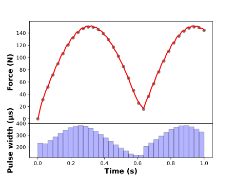

# Summary

Functional electrical stimulation (FES) is a rehabilitation method intended to promote motor recovery notably after
neurological impairment. Applying coordinated electrical pulses to muscles elicits functional movements like walking,
reaching, and grasping. FES rehabilitation mostly relies on empirical settings, as responses to stimulation vary across
populations and muscles. Empirical settings often cause overstimulation and premature fatigue [@ibitoye2016strategies],
shortening rehabilitation sessions and diminishing therapeutic benefit. Consequently, advanced control approaches like
optimal control-driven FES are gaining interest in personalizing and improving FES rehabilitation efficiency, meanwhile
delaying muscle fatigue. To address this need, we designed `Cocofest` (Custom Optimal COntrol for Functional Electrical
STimulation), an open-source Python package for optimal control-driven FES. `Cocofest` provides a framework to generate
personalized pulse trains (Fig. 1) based on nonlinear dynamics models for FES (Table. 1), for several musculoskeletal
models and motor tasks. The package provides more than 10 examples, covering optimization of FES-related pulse train
parameters (including frequency, pulse width, pulse intensity), FES model parameters identification from in vivo
measurements, and long duration predictive simulations.

{ width=90% }


# Statement of Need

Since the pioneer study on optimal control-driven FES [@hunt1997feedback], no code has been shared in the field,
limiting objective comparison and replicability across studies. The lack of open-source practice led to an absence of
consensus on how to choose nonlinear dynamics for FES, and which cost functions to use for dedicated clinical needs,
hindering standardization and cumulative progress [@co2025optimal]. To address these challenges and support collective
scientific progress, `Cocofest` fulfills the following four needs:

Firstly, the relationship between the pulse train parameters (e.g., frequency, pulse width and intensity; Fig. 1) and
the resulting muscle force, joint torque, and muscle fatigue (termed as state variables) can be modeled with different
nonlinear dynamics [@ding2003mathematical; @veltink1992nonlinear] (Table 1). Gathering them within a unified package
would facilitate comparison for more informed modelling choices.

Secondly, no study has compared different optimal control problem (OCP) formulations ap-plied to FES, due to OCP
implementation challenges [@co2025optimal]. Easily customizable OCP formulation, involving objective functions, models,
and transcriptions is required to provide an adequate research framework. Having the possibility to switch between
several OCP transcriptions, such as direct collocation or direct multiple shooting, is essential when dealing with stiff
differential equations [@puchaud2023direct], often embed in FES models. Muscle fatigue is the primary challenge in FES.
Enabling the development and comparison of different OCP formulations could help address research questions, yield novel
stimulation patterns and enhance fatigue reduction. Moreover, using receding-horizon estimation for longer simulations
reduces the computational complexity associated with time-varying dynamics (e.g., fatigue) [@ding2003mathematical].

Thirdly, predictive simulations of FES-driven or FES-assisted motions (e.g., walking, cycling, reaching, and grasping)
require the coupling of FES models with the equations of motion as well as adequate muscle force-length-velocity
relationships. Predictive simulations are usually actuated through Hill-type muscle models [@wakeling2023review]. A
package capable of replacing muscle actuation by FES models in multibody musculoskeletal models will allow us to
simulate realistic FES-driven tasks.

Fourthly, personalized rehabilitation strategy is required to facilitate the motor recovery. Therefore, identifying the
patient-specific muscle response to FES is a crucial step. Unfortunately, current complex identification methods are a
barrier to clinical translation [@le2010identification]. Providing a robust and customizable framework for the
development of more patient-friendly protocols would help to overcome this barrier.

Overall, despite its potential, optimal control–driven FES remains unadopted in clinical practice due to its low
technology readiness level [@co2025optimal]. `Cocofest` is a comprehensive package designed to bridge the gaps and
foster clinical adoption. It integrates nonlinear muscle dynamics dedicated to FES, manages muscle fatigue, interfaces
FES with musculoskeletal models, supports customizable cost functions and parameter identification routines. With the
goal of bringing this technology to patient care, we believe this package will contribute to the open-science effort.
`Cocofest` is expected to accelerate the increase of technology readiness level by strengthening knowledge foundation.

\newpage
## An optimization example: Pulse width optimization to match a force profile using the @ding2007mathematical model

This example shows how to optimize a FES pulse width using `Cocofest`, coupled with bioptim [@michaud2022bioptim]
version 3.3.0.

```python
import numpy as np
from bioptim import (ControlType, ObjectiveFcn, ObjectiveList, OdeSolver,
                     OptimalControlProgram, Node, SolutionMerge)
from cocofest import ModelMaker, OcpFes, FesModel


def prepare_ocp(model: FesModel,
                final_time: float,
                pw_max: float,
                force_tracking: list) -> OptimalControlProgram:
    """
    Prepare the Optimal Control Program by setting dynamics, bounds and cost functions.

    Parameters
    ----------
    model : DingModelPulseWidthFrequency
        The chosen FES model to use as muscle dynamics.
    final_time : float
        The ending time for the simulation.
    pw_max : float
        The maximum pulse width, used for stimulation bounds.
    force_tracking : list
        The force to track.

    Returns
    -------
    ocp : OptimalControlProgram
        The Optimal Control Program to solve.
    """
    # --- Set dynamics --- #
    # Create the number of shooting points for the OCP
    n_shooting = model.get_n_shooting(final_time=final_time)
    time_series, stim_idx_at_node_list = model.get_numerical_data_time_series(
        n_shooting, final_time
    )  # Retrieve time and indexes at which occurs the stimulation for the FES dynamic
    dynamics = OcpFes.declare_dynamics(
        model,
        time_series,
        ode_solver=OdeSolver.RK4(n_integration_steps=10),
        # Possibility to use a different solver
        # ode_solver=OdeSolver.COLLOCATION(polynomial_degree=3, method="radau"),  
    )

    # --- Set initial guesses and bounds for states and controls --- #
    x_bounds = OcpFes.set_x_bounds(model)
    x_init = OcpFes.set_x_init(model)
    u_bounds = OcpFes.set_u_bounds(model, max_bound=pw_max)
    u_init = OcpFes.set_u_init(model)

    # --- Set objective functions --- #
    objective_functions = ObjectiveList()
    # Reshape list to track to match Bioptim's target size
    force_to_track = force_tracking[np.newaxis, :]
    objective_functions.add(
        ObjectiveFcn.Mayer.TRACK_STATE,
        key="F",
        target=force_to_track,
        node=Node.ALL,
        quadratic=True,
    )

    return OptimalControlProgram(
        bio_model=[model],
        dynamics=dynamics,
        n_shooting=n_shooting,
        phase_time=final_time,
        objective_functions=objective_functions,
        x_init=x_init,
        x_bounds=x_bounds,
        u_bounds=u_bounds,
        u_init=u_init,
        control_type=ControlType.CONSTANT,
        n_threads=20,
    )

def main():
    final_time = 1
    stim = 33
    model = ModelMaker.create_model("ding2007",
                                    stim_time=list(np.linspace(0, 1, stim,
                                                               end-point=False)))

    # --- Building force to track ---#
    time = np.linspace(0, 1, 34)
    # Example of force to track between 10 and 150 N
    force = 10 + (150 - 10) * np.abs(np.sin(time * 5))
    force[0] = 0.0  # Ensuring the force starts at 0 N

    ocp = prepare_ocp(model=model,
                      final_time=final_time,
                      pw_max=0.0006,
                      force_tracking=force)
    sol = ocp.solve()

    # --- Show the optimization results --- #
    sol.graphs()


if __name__ == "__main__":
    main()
```




# Acknowledgements

The package development was supported by the Fonds de recherche du Québec – Nature et technologies (FRQNT, Grant 341023)
and by the FRQ strategic group in Ingénierie de technologies interactives en réadaptation (INTER #160 OptiStim).

# References